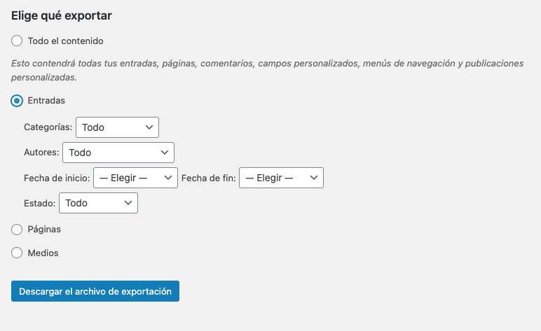

Markdown es una versión simplificada de HTML que se usa ampliamente en varios sistemas de administración de contenido en Internet. Si desea saber cómo convertir WordPress a Markdown, esta publicación puede ayudar.

### Paso 1: Exportar

Lo primero que tienes que hacer es exportar tu contenido en WordPress al formato XML. Para hacer esto ingresa a la consola de administración de WordPress y de ahí a **Herramientas/Exportar** de ahí selecciona **Entradas** (Desafortunadamente no se puede importar otro tipo de contenido), personaliza tus opciones y finalmente has click en _Descargar el archivo de contenido_



Con esto conseguiras en tu carpeda de descargas un archivo XML con un nombre así:

`[tusitio].WordPress.[fecha].xml`.

Debes renombrar este archivo a `export.xml`.

### Paso 2: Instalar Node.js y NPM

Para la conversión de XML a Markdown, vamos a utilizar un script
que está escrito en Node.js. Para wue esto funcione necesitamos instalar Node.js y NPM.
Estamos partiendo de un sistema basado en Ubuntu, de manera que podemos utilizar
`apt install` para instalar los paquetes.

```ubuntu
sudo apt install nodejs
sudo apt install npm
```

<blockquote display="info">
  Si estás utilizando un sistema que no está basado en ubuntu el sitio de Node
  te puede ayudar: 
  <a href="https://nodejs.org/es/download">nodejs.org/es/download</a>.
</blockquote>

### Paso 3: Git Clone

El script usado para convertir WordPress a Markdown se llama 
<a href="https://github.com/lonekorean/wordpress-export-to-markdown" target="blank">wordpress-export-to-markdown</a>.
Necesitamos clonar este repositorio para poder usarlo.

Primero sitúate en el directorio donde quieras ejecutar el script. y Después clona el repositorio:

```
git clone https://github.com/lonekorean/wordpress-export-to-markdown
```

Ahora debes tener un folder `wordpress-export-to-markdown`

Mueve el archivo `export.xml` que creaste anteriormente a este nuevo directorio (en la raiz del directorio).

### Paso 4: Convierte WordPress a Markdown

Ahora que ya tenemos todo lo necesario para hacer nuestra conversión del archvo WordPress.XML a Markdown. 
Volviendo a la terminal sitúate en el directorio `wordpress-export-to-markdown` y ejecuta el siguiente script:

```
# Sitúate en el directorio del Script
cd wordpress-export-to-markdown
# Instala los pre-requisitos requeridos por el script
npm install
# Ejecuta el script
node index.js
```

Y en adelante el script te llevará de la mano para las opciones que necesites para generar todos los archivos y directorios en Markdown.

<blockquote display="default">
<b>Nota:</b>

Este artículo está basado y traducido de <a href="https://kevq.uk/how-to-convert-wordpress-to-markdown/" target="blank"> este artículo </a> del blog
de Kev Quirk.
</blockquote>