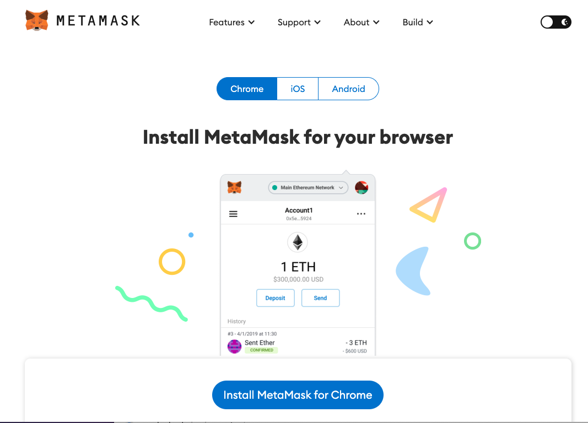

¿Quieres lanzar tu colección de NFTs, pero no sabes dónde empezar?.  Lo primero que vas a necesitar
es un monedero digital seguro (crypto wallet), que almacenará tu método de pago y te permitirá acceder a tus NFTs.

Una crypto wallet te permite comprar, vender y recibir tu NFTs, y también interactuar con sitios que integran una cadena de datos,
comunmente conocidos como aplicaciones descentralizadas (dapps) como OpenSea (https://opensea.io).

En este post te voy a mostrar lo sencillo que es iniciar con MetaMask, una crypto wallet muy popular.

## Primeros pasos con MetaMask

1. Vista https://metamask.io/download

2. Elige tu aplicación de las opciones arriba (Chrome, IOS o Android) y presiona el botón **Install Metamask**

3. Elige "Create New Account" (crear nueva cuenta) y sigue las instrucciones para configurar tu password.

4. Asegúrate de respladar tu 12-word Secret Recovery Phrase (también conocida como Seed Phrase).  Esta es 
una secuencia de 12 palabras al azar, **guárdala en un lugar seguro y no la compartas con nadie**  esta es
la manera como vas a poder agregar tu billetera a nuevos dispositivos o recuperarla en caso de que pierdas acceso.

5. Ahora estás listo para conectar tu Monedero, por ejemplo vista https://opensea.io y haz click en el icon de billetera 
en la parte superior derecha de la pantalla.  Cuando te pregunte qué Monedero vas a usar selecciona MetaMask.
