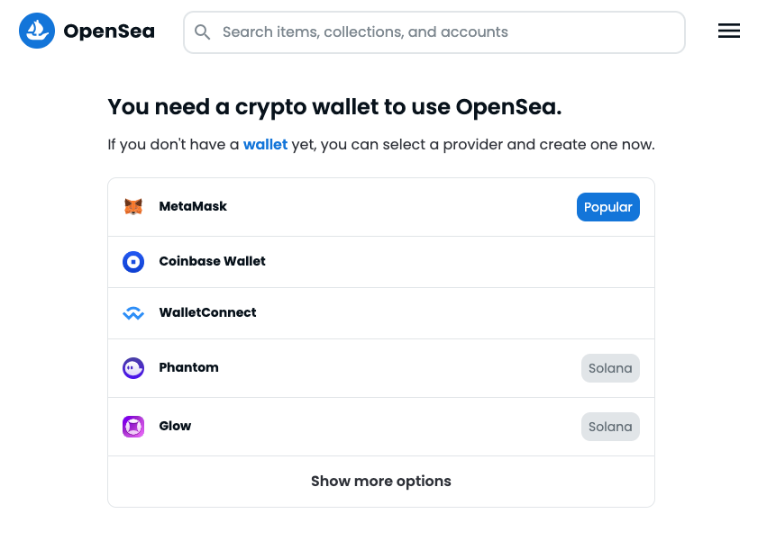
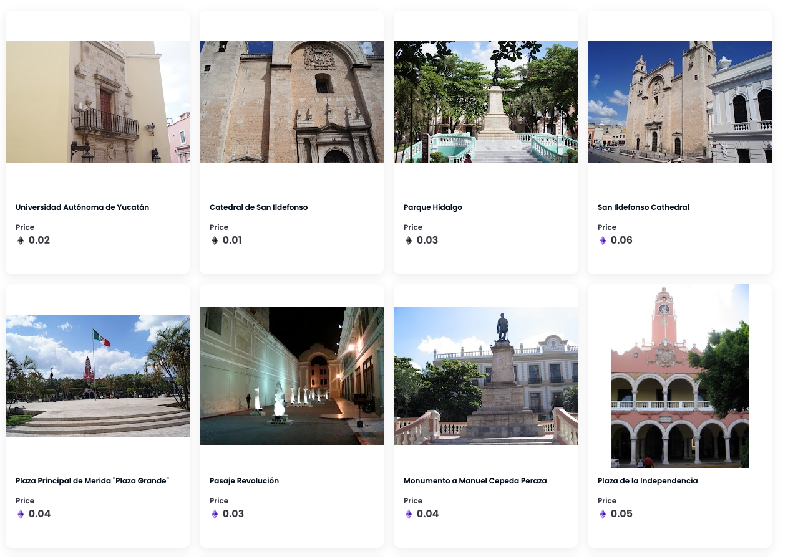

Seguramente ya has oído mucho sobre los NFTs y el furor que están causando en el mercado de inversiones.
Si quieres saber más sobre NFTs visita: [¿Que son los NFTs?](/posts/que-son-los-nfts).

A lo que quiero ir en este breve tutorial es a explicarte
cómo comprar un NFT en el mayor mercado que existe actualmente y que es Open Sea.

### 1. Cuenta en Bitso.

Primero que nada vas a neccesitar una billetera electrónica que te permita canjear tu dinero, 
si estás en México Bitso es una Gran Opción para canjear pesos mexicanos.

Para crear tu cuenta entra a: [Crear cuenta en Bitso](https://bitso.com/register?ref=zikgl)

import { Video } from "../../../../components/Complete";

El siguiente video te explica a detalle como configurar bitso.
<Video src="https://www.youtube.com/embed/A5G6WwjSXyQ" />

<blockquote display="info">Bitso te servirá para poder depositar en Pesos Mexicanos y depués transferirlos en Ether a MetaMask</blockquote>

### 2. Cuenta en MetaMask.

Metamask es la cartera con la que podrás comprar los Nfts en Open Sea.

Para instalar tu cartera Metamask Vista https://metamask.io/download/

Si quieres una explicación detallada de Metamask visita [Cómo configurar fácilmente una billetera de MetaMask](/es/posts/configurar-billetera-metamask)

Ya que tengas tu cuenta de MetaMask es importante que compres "Etherum" por ejemplo Metes mil pesos a tu cuenta de Bitso y Transfieres el equivalente en Ethereums a tu cuenta de Metamak.

Este video te explica cómo transferir fondos (ether) de Bitso a MetaMask.

<Video src="https://www.youtube.com/embed/X81j0dnmTp0" />

<blockquote display="info">Con MetaMask vas a poder comprar fácilmente NFTs en OpenSean</blockquote>

### 3. Cuenta en Open Sea.

Lo siguiente es ir a https://opensea.io/login  ahí seleccionas la opción de Metamask y entras con la cuenta que creamos previamente.

Ya en Metamask te va a dar varias opciones para ver las tendencias y puedas elegir en qué NFTs invertir.

### 4. Compra de la Colección del Turista Yucatán

Una colección de NFTs Mexicana (Yucateca para más específico) es https://opensea.io/collection/turistayucatan. 
Aprovechen ahorita que está empezando y los precios están bajos.  

<blockquote display="default">La colección cuenta con el Respaldo del Turista México (https://turista.com.mx) entonces 
es muy probable que tienda a subir de precio.</blockquote>

En esta colección hay NFTs muy económicos, desde 0.01 Ethereums que son algo así de $300 pesos mexicanos (al 7 de Septiembre 2022).

En esa colección eliges el que más te guste (o al que le veas más posiblidades de crecer de valor) y presionas el botón "Buy Now"
Por ejemplo 
[Este NFT de una Mestiza](https://opensea.io/assets/ethereum/0x495f947276749ce646f68ac8c248420045cb7b5e/40204312931910274261888319886493561627181628932808286703084245925358922104833/)

Y eso es todo,  Bienvenido al mundo de la compra de NFTs.

Un video Final sobre la Compra de NFTs
<Video src="https://www.youtube.com/embed/tLc4i1IEp04" />
